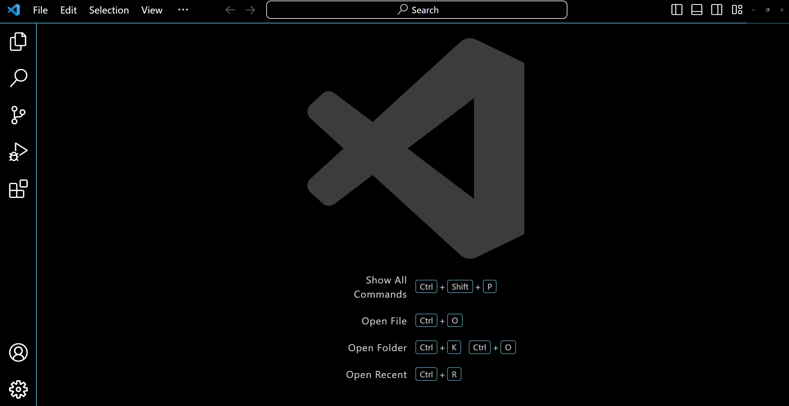
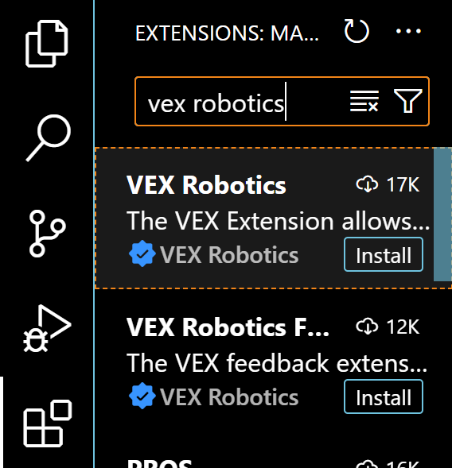
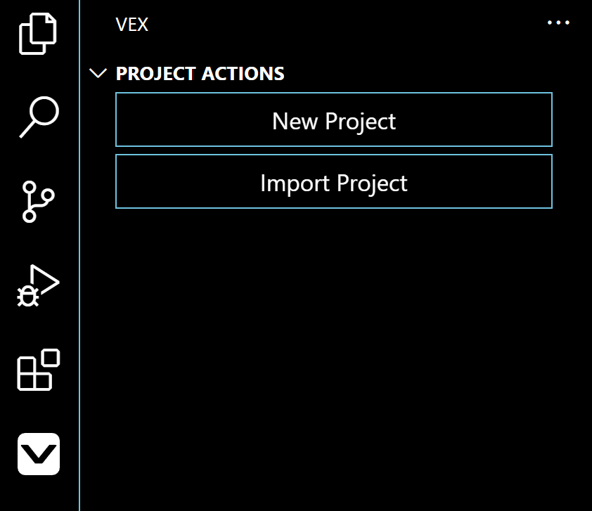
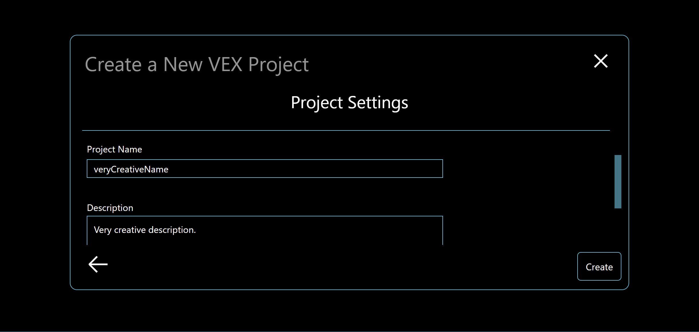
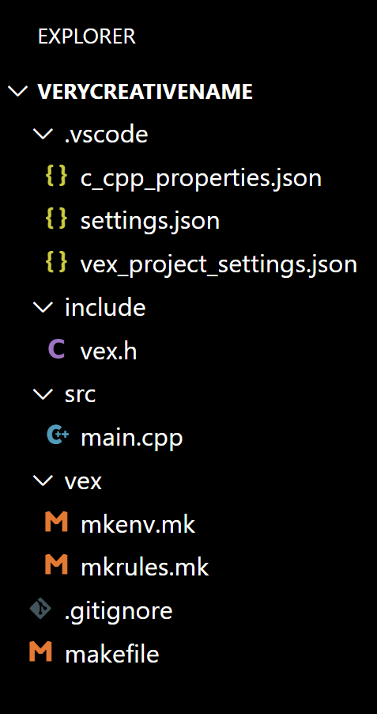

# Introduction to VEXcode V5 C++
This guide provides an introduction to the basics of VEXcode C++. If you prefer video tutorials,
you can also check out our [video guide](https://github.com/9204A-B/intro-Cpp?tab=readme-ov-file#additional-resources).  

## Getting Started  

Start by installing Visual Studio Code from [here](https://code.visualstudio.com/download).  
Just run the .exe file and agree to the terms.  
Once installed, VS Code should look like this:  
  

Next press Ctrl + Shift + X and type in "VEX Robotics" and install the VEX extension.  
  
Once installed you should see a new icon that looks like this:  
  

## Creating a project

In the new window select "New Project"
  
Choose the V5 option. Note: This guide is meant for V5, so IQ/EXP may not work the same way.  
  
Next select C++. If you're looking for the Python guide, it's available [here](https://github.com/9204A-B/intro-python).
</img>  

There are options for templates, but for this guide, we'll use the empty project.
Give your project a name.
  

You will see sereval files inside of the Explorer tab now.  
  

We only need to modify files inside of the include and src directories   
All .cpp files should be in src  
All .h files should be in include  
A basic 4 motor drivetrain with an addition motor could look like this:   
### src/main.cpp
```C++
#include "vex.h"

using namespace vex;

int main()
{
    // Vex requires this function to initalize everything
    vexcodeInit();
    Competition.autonomous(auton);
    Competition.drivercontrol(drive);
    Controller.ButtonR1.pressed(toggleSpin);
}
```  
### src/robot-config.cpp  
```C++
#include "vex.h"

using namespace vex;

//Initalize devices/variables here
brain Brain;
controller Controller = controller(primary);
motor leftMotorA = motor(PORT1, ratio18_1, true);
motor leftMotorB = motor(PORT2, ratio18_1, true);
motor_group leftDriveSmart = motor_group(leftMotorA, leftMotorB);

motor rightMotorA = motor(PORT3, ratio18_1, false);
motor rightMotorB = motor(PORT4, ratio18_1, false);
motor_group rightDriveSmart = motor_group(rightMotorA, rightMotorB);

drivetrain Drivetrain = drivetrain(leftDriveSmart, rightDriveSmart, 320, 318, 255, mm, 1);

motor flyWheel = motor(PORT5, ratio18_1, false);

competition Competition;

bool spin = false;

// Vex requires this function to initalize everything
void vexcodeInit(void)
{
    Drivetrain.setDriveVelocity(100, percent);
    Drivetrain.setStopping(brake);
    flyWheel.setVelocity(100, percent);
    flyWheel.setStopping(coast);
}

```  
### include/robot-config.h   
```C++
using namespace vex;
// Just call all the objects and methods inside of our robot-config.cpp
extern brain Brain;
extern controller Controller;
extern motor leftMotorA;
extern motor leftMotorB;
extern motor_group leftDriveSmart;
extern motor rightMotorA;
extern motor rightMotorB;
extern motor_group rightDriveSmart;
extern drivetrain Drivetrain;
extern motor flyWheel;
extern competition Competition;
extern bool spin;

void vexcodeInit(void);
```  
### include/vex.h  
```C++
// Don't worry about everything in here just add the 2 following lines
#include "robot-config.h"
#include "methods.h"
```
Let's make src/drive.cpp  
```C++
#include "vex.h"

using namespace vex;

void drive(void)
{
    while (true)
    {
        //Basic arcade drive
        //Controller has the axis numbers next the to joy sticks
        leftDriveSmart.setVelocity((Controller.Axis3.position() + Controller.Axis1.position()), percent);
        rightDriveSmart.setVelocity((Controller.Axis3.position() - Controller.Axis1.position()), percent);
        leftDriveSmart.spin(forward);
        rightDriveSmart.spin(forward);
        //It must wait otherwise nothing will happen
        wait(20, msec);
    }
}
```  
Create src/auton.cpp  
```C++
#include "vex.h"
using namespace vex;
void auton(void)
{
    Drivetrain.driveFor(forward, 20, inches);
    flyWheel.spin(forward);
    wait(10, sec);
    flyWheel.stop()
}
```
Create src/toggleSpin.cpp  
```C++  
#include "vex.h"
using namespace vex;

void toggleSpin(void)
{
    if (!spin)
    {
        spin = true;
        flyWheel.setVelocity(100, percent);
        flyWheel.spin(forward);
    }
    else
    {
        spin = false;
        flyWheel.setVelocity(0, percent);
        flyWheel.stop();
    }
}
```
Lastly create include/methods.h  
```C++
using namespace vex;
// Just copy the headers of the methods you've created
void drive(void);
void auton(void);
void toggleSpin(void);
```
You can look at our competition code written in [C++](https://github.com/9204A-B/OverUnder/tree/main/VexTestCode) or our [tablebot code](https://github.com/9204A-B/TableBot)  
## Running Your Program  
Upload by connecting the brain to the PC, and you'll see a download button appear in the bottom left corner.  
  

**From the Controller**  
  
Navigate using the arrow keys, select programs, navigate to the selected slot, and hit run.

**From the Brain**  
  
Click on the program at the bottom or select the programs folder to see everything.

## Additional Resources
[VEXcode V5 C++ API Documentation](https://api.vexcode.cloud/v5/)  
[YouTube Guide](https://youtube.com/playlist?list=PLkJYTVlbDhUbdypypS46la5xFOnpnOFFX&si=pMRX561FNS6AxHgY)  

## Authors
[Logan Dresel](https://github.com/coollogan876)
